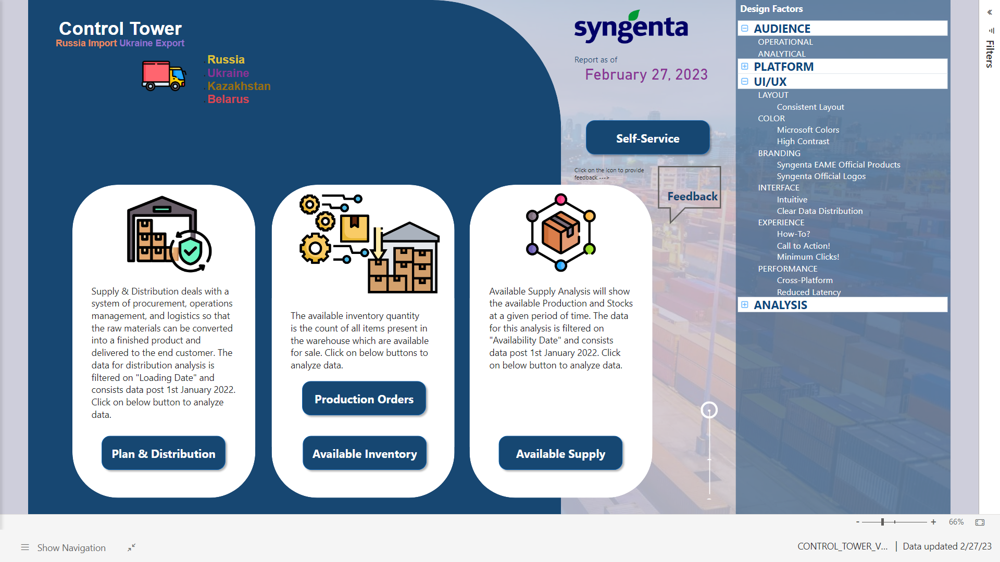
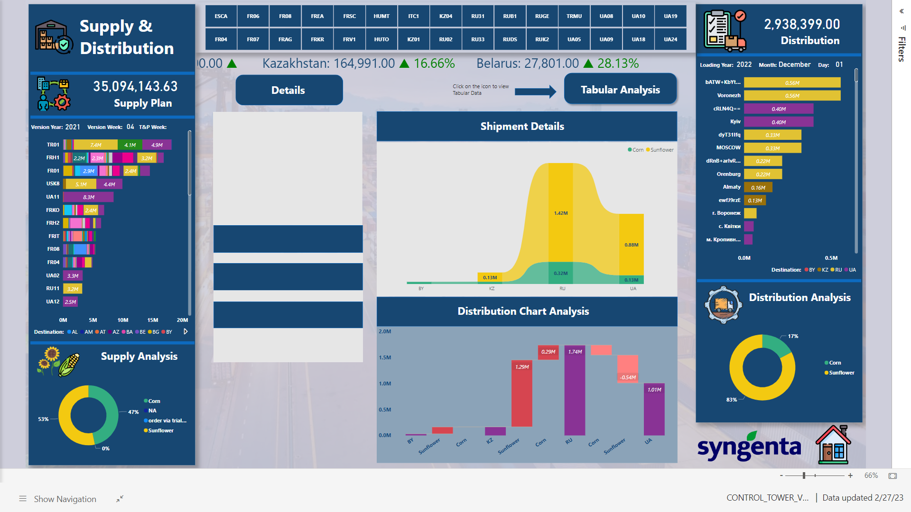
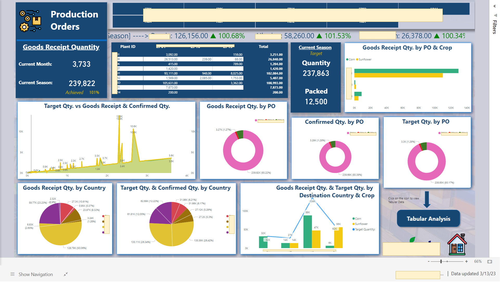
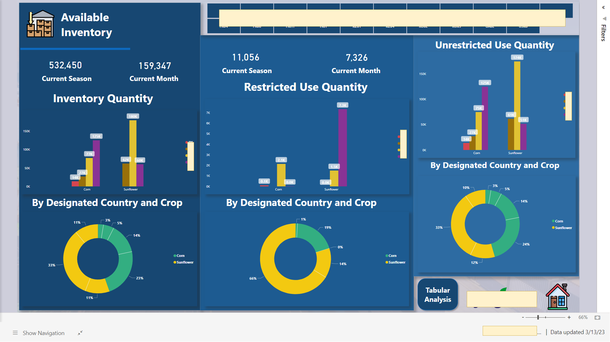
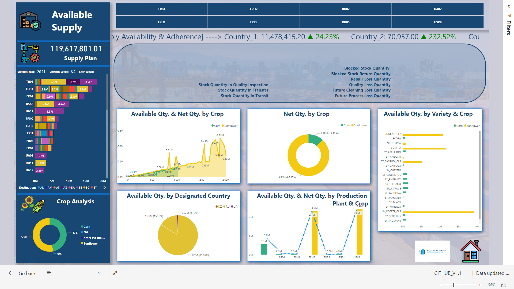
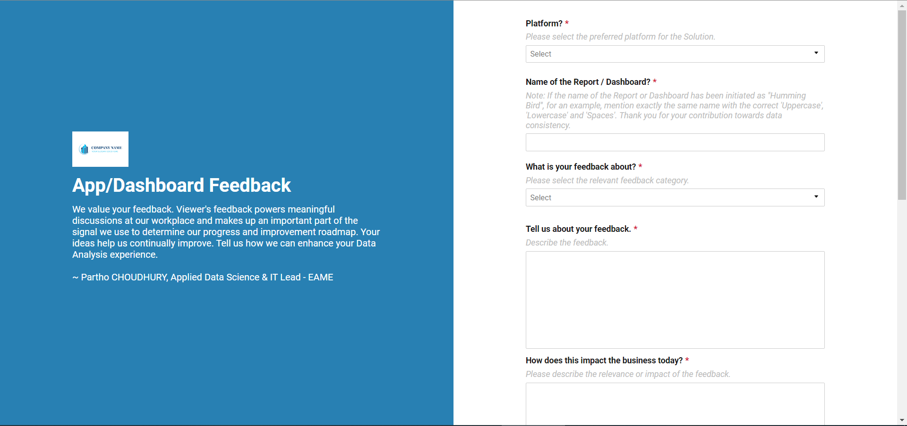
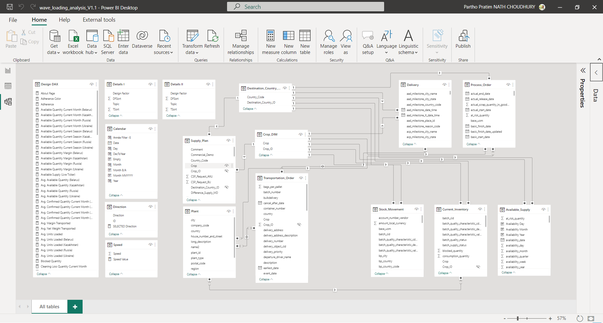
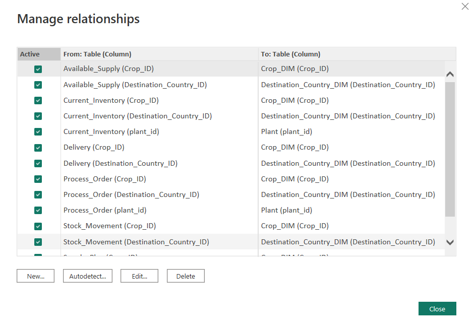
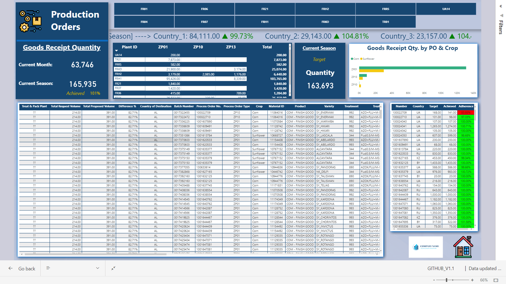

# Improve Business Decision Making Capabilities using Advanced Analytics/Business Intelligence with PostgreSQL and DAX 📈
This is a project based on the issues faced by the Company to deliver the products to Country_1 and Country_2, and due to the increasing tensions and the change of the regulations, the deliveries to Country_3 and Country_4, too. The purpose of this project is set to achieve the real time tracking of the Planned Supply vs the Ongoing Loading as per the plan and the Production Required for the supply with "Treat & Pack" adherence.


## > :rocket: **Thank you for your interest in my work.** :blush:

This solution aims at developing a realtime tracker with extra smart visuals for tracking the Plan VS Execution scenario, for "Country_1", "Country_2", "Country_3" and "Country_4".

It leverages rich and diverse priors encapsulated with pretrained **PostgreSQL Queries** ----> **DAX** (e.g., DAX Measures) for **ETL**.

## Business Intelligence, Dashboard Design, Dashboard Interface for Business 📊

In the world of Big Data, the need for business intelligence dashboards is widely understood. Most businesses know that they need a central location to gather and display relevant insights to different users. Well-designed dashboards can take complex data and turn it into useful information, while bad dashboards do just the opposite.

But creating a dashboard that is clear, concise, and easy to understand can be a daunting task. With the application of design principles and best practices, any business can create a business intelligence dashboard that provides an overall view of the health of their business, with an opportunity for user engagement as needed.

#### Why Design and Context is Important in Designing a Business Intelligence Dashboard? ####

The design and context of a business intelligence dashboard is crucial for increasing user engagement and understanding. The purpose of a dashboard is twofold; the first is to highlight the most important data, and the second is to provide context for that data. Data alone is difficult to interpret.

By providing context, the data tells a story and starts to make sense to the user — they can find meaning, see opportunities for growth, and identify any potential challenges or obstacles in their business. The design and context together give the user an at-a-glance idea of where things are and where they’re headed.

#### What To Include in a Business Intelligence Dashboard? ####

Different businesses and industries will require different information displayed on their analytics dashboard. However, some general data sets apply to every business. This data includes the overall budget (year-to-date spending, revenue, and profits), as well as marketing efforts (campaign cost and ROI) and project management (planned vs. completed work).

To determine what you should include in a specific dashboard, identify the current opportunities and obstacles facing your business, design a rough prototype, and refine with user research. Consider searching for visual examples within your industry.

### Best Practices for Business Intelligence Dashboard Design!📜 ###

**Simplify and Summarize Content:**
Because business intelligence dashboard design is only for providing a high-level look at business operations, you don’t need to include details of every project. Instead, simplify and summarize the key takeaways from various data sets so users can scan the dashboard quickly and get an idea of what’s going on in the business.

**Prioritize Your Insights:**
There will always be more data available than space to display it. Prioritize your information so that the dashboard contains only the information that is most relevant to your user. Limit yourself to the top five or ten KPIs (key performance indicators) for your business.

**Organize Information Visually:**
For a user to engage successfully with a business intelligence dashboard, they must be able to find answers to their questions within five to seven seconds of scanning a page. The better organized the data, the more likely users will be able to find answers quickly. It’s essential to adjust the size of different elements to show which parts of the dashboard are most important.

**Consider Device Size:**
Many business executives are accessing their real-time dashboards on a desktop computer while they are in the office and on their mobile phones while on the go. Because of the limited size of handheld devices, it’s important to pare down the information included on your dashboard so that only the most vital insights are displayed. Consider creating a specific mobile version of your dashboard to ensure that your data is optimized to display at a smaller size.

**Allow for Customization:**
Different users will have different needs in accessing the business intelligence professional dashboard. Rather than displaying all the information at once, consider including a filter at the top of the dashboard for users to select what data sets they want to view.

**Allow for More Exploration:**
The primary purpose of the business intelligence dashboard is to provide users with a high-level view of the business. But many users will want to focus on a particular piece of information, and the dashboard system design should allow them to click, tap, or swipe to reveal more details.

**Use Icons to Increase Understanding:**
Most users see and understand graphics faster than the written word. Using simple iconography can help them interpret the data more quickly and with less effort. For example, use a dollar sign to represent spending, and computer or laptop to show website traffic.

**Choose the Right Type of Data Visualization:**
Different types of data are best explained through different types of visualizations. It’s important to select the right kind of data visualization so that the user doesn’t misinterpret the data. To show trends over time, consider a line graph. For comparing two products, consider a table. The right data visualization will help the user draw the right conclusion from the data.

**Use Color Effectively:**
Color should be used to enhance a data set, not distract or detract from it. Use business brand colors if needed, but also consider using generic colors to provide relevant meaning. For example, clients acquired could be shown in green to indicate positive results, while clients lost could be shown in red to indicate a negative result.

_Data visualization and data discovery are the most critical elements of your Business Intelligence (BI) delivery - so they'd better be right.💯_

## My Solution 💡

In this Power BI End Project, I have investigated multiple dataset's for the Company called **DROPLETS** and analyzed their churn rates. This business case helps to understand, why we are not able to deliver products to the customers, what are the obligations, and how we are handling the uncertanities.


**The Overview:**

<p align="center">
  
</p>
<p align="center"><b>Scenario 1:</b> The front Page of the Final Dashboard with Navigation Buttons.</p>

**Supply Plan VS Distribution:**

<p align="center">
  
</p>
<p align="center"><b>Scenario 2:</b> The Supply Plan VS Distribution Comparison based on Dynamic Visuals and smart selections.</p>

**Seasonal Production:**

<p align="center">
  
</p>
<p align="center"><b>Scenario 3:</b> The seasonal production based on the treatment and pachaging for the required product lot with Dynamic Visuals and smart selections criterias.</p>

**Available Inventory:**

<p align="center">
  
</p>
<p align="center"><b>Scenario 4:</b> The current available inventory with the restricted and unrestricted quantities for use with Dynamic Visuals and smart selections criterias.</p>

**Available Supply:**

<p align="center">
  
</p>
<p align="center"><b>Scenario 5:</b> The estimated available supply for the planning the requirement adherence, when required, for use with Dynamic Visuals and smart selections criterias.</p>

**Additional Initiative: A Feedback Page**

<p align="center">
  
</p>
<p align="center"><b>Scenario 6:</b> A feedback page available through the navigation button on the Home Page/Overiew Page designed with Smartsheet App, so that the users are not dependent on Emails and Chats and can register their request based on valid points related to the Business Needs.</p>

# Load the Data with ODBC ⚖

Because the company database system is managed by AWS and the resources provided by AWS cloud for Microsoft are limited, I would suggest to load the data with ODBC.

**Capabilities Supported**
- Import
- Advanced options

        Connection string (non-credential properties)
        SQL statement
        Supported row reduction clauses

- >   **Server:** console.server_schema.(company_name)aws.org
- >   **Port:** ****
- >   **Database:** ****

**ODBC Connection String**
_64 Bit_
- >   Driver={Amazon Redshift (x64)}; Server=console.server_schema.(company_name)aws.org; Port=****; Database= ****

#### **Known issues and limitations**

**Connection string attributes**

If a DSN is specified in the ODBC connection string, the attributes after the DSN specification aren't included. If you want to use additional attributes, update them in the DSN itself, as opposed to in the connection string.

**On-Premises Data Gateway**

Gateway cluster with load balancing is enabled for all the workloads for this project, where it receives a request from one of the cloud services (like Power BI), it randomly selects a gateway member. If this member gateway is already at or over one of the throttling limits specified below, another member within the cluster is selected. If all members within the cluster are in the same state, the request fails. The Gateway Cluster for these data tables are enabled to 2 different clusters.

During the setup the following settings were enabled in the Microsoft.PowerBI.DataMovement.Pipeline.GatewayCore.dll.config file available in the Program Files\On-premises data gateway folder in order to adjust throttling limits. Concurrency throttling is enabled by default.

- **CPUUtilizationPercentageThreshold** - This configuration allows gateway admins to set a throttling limit for CPU. The permissible range for this configuration is 0 to 100. A value of 0, which is the default, indicates that this configuration is disabled.
- **MemoryUtilizationPercentageThreshold** - This configuration allows gateway admins to set a throttling limit for memory. The permissible range for this configuration is 0 to 100. A value of 0, which is the default, indicates that this configuration is disabled.
- **ResourceUtilizationAggregationTimeInMinutes** - This configuration sets the time in minutes for which CPU and memory system counters of the gateway machine are aggregated. The aggregated values are then compared against the respective threshold limits set for CPUUtilizationPercentageThreshold and MemoryUtilizationPercentageThreshold. The default value for this configuration is 5.
- **ConcurrentOperationLimitPreview** - This configuration sets concurrent operation limit for the Gateway. BypassConcurrentOperationLimit can be set to remove all concurrent operation limits. The default value for this configuration is 40.

**Example errors when limit encountered**
```
The gateway you selected can't establish data source connections because it's exceeded the CPU limit set by your gateway admin. Try again later, or ask your gateway admin to increase the limit.

The gateway you selected can't establish data source connections because it's exceeded the memory limit set by your gateway admin. Try again later, or ask your gateway admin to increase the limit.

The gateway you selected can't establish data source connections because it's exceeded the concurrency limit set by your gateway admin. Try again later, or ask your gateway admin to increase the limit.
```

# START your SQL Queries 📜

- SQL is a standard language for accessing and manipulating databases.

**What is SQL?**
- SQL stands for Structured Query Language.
- SQL lets you access and manipulate databases.
- SQL became a standard of the American National Standards Institute (ANSI) in 1986, and of the International Organization for Standardization (ISO) in 1987.

**What Can SQL do?**
- SQL can execute queries against a database.
- SQL can retrieve data from a database.
- SQL can insert records in a database.
- SQL can update records in a database.
- SQL can delete records from a database.
- SQL can create new databases.
- SQL can create new tables in a database.
- SQL can create stored procedures in a database.
- SQL can create views in a database.
- SQL can set permissions on tables, procedures, and views.

**SQL is a Standard - BUT....**
Although SQL is an ANSI/ISO standard, there are different versions of the SQL language.

However, to be compliant with the ANSI standard, they all support at least the major commands (such as SELECT, UPDATE, DELETE, INSERT, WHERE) in a similar manner.

**Using SQL in Your Web Site**
To build a web site that shows data from a database, you will need:

- An RDBMS database program (i.e. MS Access, SQL Server, MySQL)
- To use a server-side scripting language, like PHP or ASP
- To use SQL to get the data you want
- To use HTML / CSS to style the page

**You can find the PostgreSQL Queries used for this project in the folder's:**
- [Distribution Table](https://git.syngentaaws.org/partho_choudhury/control-tower/-/blob/main/supply_delivery_document.sql)
- [Production Table](https://git.syngentaaws.org/partho_choudhury/control-tower/-/blob/main/supply_production.sql)
- [Stock Movement](https://git.syngentaaws.org/partho_choudhury/control-tower/-/blob/main/supply_stock_movement.sql)
- [Current Inventory](https://git.syngentaaws.org/partho_choudhury/control-tower/-/blob/main/current_inventory.sql)
- [Transportation Order](https://git.syngentaaws.org/partho_choudhury/control-tower/-/blob/main/supply_transportation_order.sql)
- [Available Supply](https://git.syngentaaws.org/partho_choudhury/control-tower/-/blob/main/available_supply.sql)


### **SQL Mind Mapping for Advanced Data Analytics !**

*How do you explain mind mapping?*

- A mind map involves writing down a central theme and thinking of new and related ideas which radiate out from the centre. By focusing on key ideas written down in your own words and looking for connections between them, you can map knowledge in a way that will help you to better understand and retain information.

<p align="center">
  
</p>
<p align="center"><b>Mind Map:</b> Mind Mapping for Better Understanding of SQL.</p>

# Data Model Optimization 🚶‍♂️ 

## 💾 **Initial: Prepare the Data Model for Analytics and Effective Transformation**

The model is designed following the best practices for better performance of data. As you can see below, the rules are segmented into categories. Some rules are more aesthetic-oriented while others are more focused on performance optimization. Note that there are several rules which require running an additional script.

**DAX Expressions**
- Use the DIVIDE function for division.
- Avoid using the IFERROR function.
- Column references should be fully qualified.
- Measure references should be unqualified.
- Measures should not be direct references of other measures.
- No two measures should have the same definition.
- Use the TREATAS function instead of INTERSECT for virtual relationships.


**Error Prevention**
- Data columns must have a source column.
- Calculated columns must have an expression.


**Formatting**
- Add data category for columns.
- Do not summarize numeric columns.
- First letter of objects must be capitalized.
- Hide fact table columns.
- Hide foreign keys.
- Mark primary keys.
- Month (as a string) must be sorted.
- Objects should not start or end with a space.
- Percentages should be formatted with thousands separators and one decimal.
- Format flag columns as Yes/No value strings.
- Provide format string for “Date” columns.
- Provide format string for “Month” columns.
- Provide format string for measures.
- Relationship columns should be of integer data type.
- Whole numbers should be formatted with thousands separators and no decimals.


**Maintenance**
- Ensure tables have relationships.
- Objects with no description.
- Remove data sources not referenced by any partitions.
- Remove roles with no members.
- Remove unnecessary columns.
- Remove unnecessary measures.


**Naming Conventions**
- Use CamelCase for hidden columns.
- Partition name should match table name for single partition tables.
- Object names must not contain special characters.


**Performance**
- Avoid bi-directional relationships against high-cardinality columns.
- Avoid excessive bi-directional or many-to-many relationships.
- Avoid snowflake schema architecture.
- Do not use floating point data types.
- Large tables should be partitioned.
- Limit row level security (RLS) logic.
- Many-to-many relationships should be single direction.
- Minimize Power Query transformations.
- Model should have a date table.
- Model using Direct Query and no aggregations.
- Reduce number of calculated columns.
- Reduce usage of calculated columns that use the RELATED function.
- Reduce usage of calculated tables.
- Reduce usage of long-length columns with high cardinality.
- Remove auto-date table.
- Remove redundant columns in related tables.
- Set IsAvailableInMdx to false on non-attribute columns.
- Split date and time.
- Date/calendar tables should be marked as a date table.
- Unpivot pivoted (month) data.


<p align="center">
  
</p>
<p align="center"><b>Scenario 7:</b> The Data Model behind the Transformation.</p>

While setting up my data model, I started by organizing my tables. As you can see in the image above, one of the best ways to do this is by using the Waterfall technique. Another way to do this effectively is by using the Star Schema approach. 

<p align="center">
  
   
</p>
<p align="center"><b>Scenario 8:</b> Example of the Data/Table Relationship.</p>

The Manage Relationships dialogue also makes it easy to view the cardinality and its direction.

Ideally, relationships can either be one-to-many or many-to-one. Power BI is excellent at defaulting the cardinality according to your data.

## Results and Next Steps 💯

<p align="center">
  
  
</p>
<p align="center"><b>Test 1:</b> 'Country_1', 'Country_2', 'Country_3' & 'Country_4' Order Lines alligned with Seasonal Line Production.</p>

- **Best Performance:** Production for the Season Alligned with the Supply Requirements/Alligned with KPI's: >=95% "Green", >=90% && <95% "Yellow"
, and <90% "Red"
- **Supply Plan vs. Distribution Allignment:** Clustering for Data based on the Monthly Plan for the Season, 92% alligned with the Distribution.
- **Current Inventory based of the Inventory Report Date:** Availability of the Inventory Data for the latest report date is alligned.

**Next Steps:**
To estimate the impact of wave loading strategy on the supply productivity, we will run several simulations with a gradual number of orders per wave:
1. Evaluate the Production KPI based on Customer Needs and Divert the Flow based on Predictions: How much is required more to fulfill the next allignment, what is required?
2. Record Picking Route per Wave: Recording the sequence of locations per route for further analysis based on advance predictions.

# **Use the application** 🖥️ 
> This app has been deployed internally.

#### **Why should you use it?** 
> This Power BI Cloud/Service Application has been designed for **Regional Business Leadership Team** to help them simulate the impact of data optimization in analyzing the Supply Plan Execution with the Distribution and Production.

#### **Load the data**

- You cannot use the dataset of this project due to business security reasons.
- You can build your own dataset following the step of ('Initial Step') above.

##### **Comment 1:** Scope

As the computation time can increase exponentially with the size of the dataset _(optimization can be done)_ you can change the model and the data load according to the need.

##### **Comment 2:** Fix the range of orders/loading wave to simulate

We can modify the model to run a loop testing scenario with the number of orders per wave varying between planned scenario and the executed scenario.

##### **Comment 3:** START CALCULATION

- The MEASURE keyword introduces a measure definition (DEFINE) in a query (also known as query measure).
- The syntax after MEASURE defines a measure, which can be consumed in any other expression of the same query.
- A query measure overrides a model measure with the same name. However, its definition is only used in other query measures; other model measures continue to use the model measure definition.

- You can find the example DAX Queries used for this project in the folder's:
[control-tower/DAX_solution_measures__Examples_.txt](https://git.syngentaaws.org/partho_choudhury/control-tower/-/blob/main/DAX_solution_measures__Examples_.txt)
- You can find more advance DAX measures format in the folder:
[control-tower/DAX_World/DAX_World.xlsx](https://git.syngentaaws.org/partho_choudhury/control-tower/-/blob/main/DAX_World/DAX_World.xlsx)

### **Final Results**
<p align="center">
  
    
</p>
<p align="center"><b>Experiment 1:</b> Production Results.</p>

💡 This is the same graph with the one presented in the article above. 


# About me 🤓
- With 10+ years of industry experience, I have thrived in Data Science, Data Governance, IT and Product Management. I have a keen interest and expertise in solving business problems using unique logic and analytics. I bring solutions to the table based on competitive Business Acumen and Human Intelligence.
- Have a look at my portfolio: [Helping organization level all their Seeds Business arguments using Data🔧 & Technology🔨 | Ex_Zalando | Ex_Freecharge | Ex_Myntra Jabong | Ex_Supercell | Ex_Infosys](https://www.linkedin.com/in/pnchoudhury/)
- I love talking about #algorithms, #dataanalytics, #datapipelines, #machinelearning, and #artificialintelligence 
